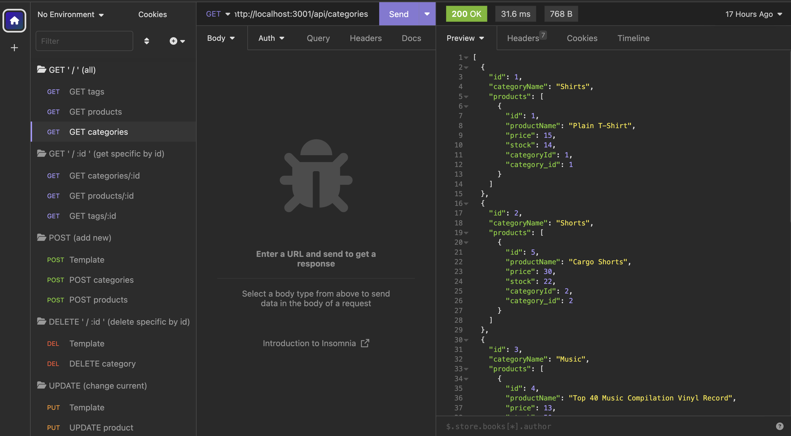

# 13-Object-Relational-Mapping

## License
&nbsp;

* Select the badge to see details.
* To see more about license badges, visit [Shields IO](https://shields.io/category/license)

&nbsp;

## Description
As a manager at an internet retail company I would like a back end for my e-commerce website. This back end uses the latest technologies in keeping data update so that my company can compete with other e-commerce companies. When I run tests on API POST, PUT, and DELETE routes in Insomnia, I am able to quickly and successfully make necessary modifications to data in my database.

&nbsp;

## Table of Contents

 * [Installation](#installation)
 * [Usage](#usage)
 * [Media](#media)
 * [Testing](#testing)
 * [Contribution](#contribution)
 

&nbsp;

## Installation

There are several steps involved. The most important are to make sure you establish reliable and smooth flowing access to your mySQL account as well as the abiltiy to quickly and easily open a local port on your PC in order to use Insomnia effectively.

1. Make sure you have [Node.js](https://nodejs.org/en) installed.
2. Install the following NPM modules on your root directory:
     * dotenv: 8.6.0
     * express: 4.18.2
     * mysql2: 2.3.3
     * sequelize: 6.32.0
3. Clone this repo to your machine.
4. Open .env and enter your database name and mySQL login crendentials.
5. Open the server.js file in a terminal and type in 'npm start' to open up a port
6. You will now be ready to use [Insomnia](https://insomnia.rest/download) to test API routes you have created.
7. NOTE:
     * You will need to create & seed your database.
8. There is a video link below to give you an idea how Insomnia works in testing your Object Relational Mapping.

&nbsp;

[Table of Contents](#table-of-contents)

## Usage

See the video

&nbsp;

[Table of Contents](#table-of-contents)

## Media
_A brief overview of the project build_
&nbsp;

* Visit [Full Media](https://drive.google.com/file/d/1RP5O_m4o5pA8fouVVtnfsFCCwfmUrG7Y/view) to see more details

&nbsp;

[Table of Contents](#table-of-contents)

## Testing

Testing of these APIs or one that you create can be done through Insomnia or Postman.

&nbsp;

[Table of Contents](#table-of-contents)

## Contribution

&nbsp;

[Table of Contents](#table-of-contents)

## Questions

_If you have any questions, please feel free to contact me._

GitHub Username: [waynefenwick](https://github.com/waynefenwick)

Email Address: <a href="mailto:waynefenwick@gmail.com">waynefenwick@gmail.com</a>

&nbsp;

_Thanks for taking time to visit this repository!_

[Back to Top](#)

